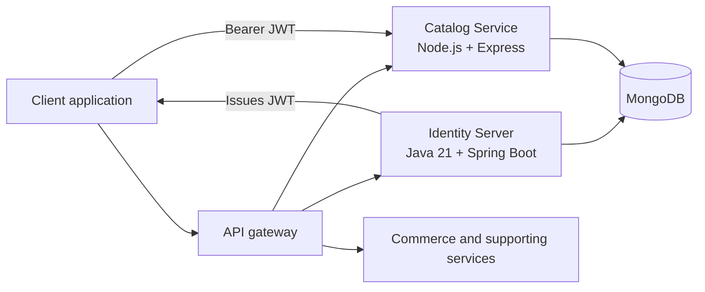
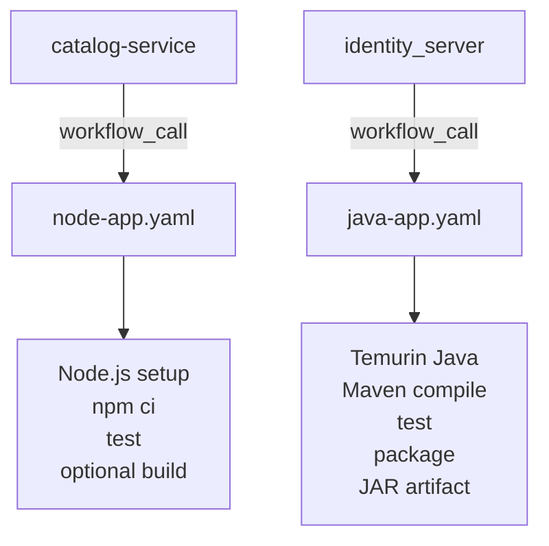

# MERN E-Commerce Cloud Platform

A polyglot e-commerce platform organized as independently deployable services with shared authentication, MongoDB persistence, and centralized CI/CD workflows.

## Architecture

## Implemented Services

### Identity Server

The Java 21 Spring Boot service provides:

- User registration and login
- Password reset and password changes
- User profiles and address management
- Stateless JWT authentication with Spring Security
- BCrypt password hashing
- MongoDB persistence through Spring Data MongoDB

### Catalog Service

The Node.js and Express service provides:

- Product, category, and brand management
- Product reviews and user wishlists
- Filtering, pagination, slugs, and activation state
- JWT and role-based authorization through Passport-JWT
- MongoDB persistence through Mongoose

Both services are independently runnable and use a shared MongoDB data model. The Identity Server issues seven-day HS256 JWTs; Catalog verifies the shared `JWT_SECRET` and uses the roles `ROLE ADMIN`, `ROLE MEMBER`, and `ROLE MERCHANT`.

## Repositories

| Repository | Responsibility | Technology or focus |
|---|---|---|
| [client-service](https://github.com/ppmcad16a-cloud-platform/client-service) | Client application | Frontend boundary |
| [api-gateway-service](https://github.com/ppmcad16a-cloud-platform/api-gateway-service) | API gateway | External routing boundary |
| [identity_server](https://github.com/ppmcad16a-cloud-platform/identity_server) | Authentication, users, addresses | Java 21, Spring Boot, Spring Security, MongoDB |
| [catalog-service](https://github.com/ppmcad16a-cloud-platform/catalog-service) | Products, categories, brands, reviews, wishlists | Node.js, Express, Mongoose, MongoDB |
| [commerce-service](https://github.com/ppmcad16a-cloud-platform/commerce-service) | Commerce domain | Service boundary |
| [notification-service](https://github.com/ppmcad16a-cloud-platform/notification-service) | Notifications | Service boundary |
| [seed-db-service](https://github.com/ppmcad16a-cloud-platform/seed-db-service) | Database initialization | Service boundary |
| [core-cloud-platform](https://github.com/ppmcad16a-cloud-platform/core-cloud-platform) | Shared CI/CD workflows | Reusable GitHub Actions |
| [terraform-modules](https://github.com/ppmcad16a-cloud-platform/terraform-modules) | Infrastructure modules | Terraform roadmap |
| [aws-platform](https://github.com/ppmcad16a-cloud-platform/aws-platform) | AWS platform resources | Cloud platform roadmap |
| [security-platform](https://github.com/ppmcad16a-cloud-platform/security-platform) | Security automation | Security roadmap |
| [observability-platform](https://github.com/ppmcad16a-cloud-platform/observability-platform) | Monitoring and telemetry | Observability roadmap |

## Reusable CI/CD

The [`core-cloud-platform`](https://github.com/ppmcad16a-cloud-platform/core-cloud-platform) repository centralizes reusable GitHub Actions workflows. Application repositories provide their own triggers and call the shared workflows with service-specific inputs.

Current reusable workflows provide:

- Node.js 20 setup, npm caching, `npm ci`, tests, and optional builds
- Java 21 Temurin setup, Maven caching, compilation, tests, packaging, and JAR artifacts
- Configurable runtime-version inputs and test execution
- Thin service-level caller workflows triggered by pushes and pull requests

The services also use focused automated testing:

- Catalog: Jest, Supertest, and MongoDB Memory Server
- Identity: JUnit, Spring Boot Test, Spring Security Test, and JaCoCo

## Platform Roadmap

The platform is being extended toward a multi-cloud delivery model covering AWS, Microsoft Azure, and Google Cloud, with Kubernetes as the common runtime.

Planned capabilities include:

- Docker image builds and registry publishing
- Terraform provisioning and remote state
- Kubernetes deployment workflows
- Source, dependency, IaC, secret, and container scanning
- Observability dashboards, metrics, logs, traces, and alerts
- Cloud secret-manager integration through OIDC
- Staging and production environments
- Approval-based promotion, health checks, and rollback

See the [core-cloud-platform README](https://github.com/ppmcad16a-cloud-platform/core-cloud-platform#readme) for reusable workflow standards and implementation details.
